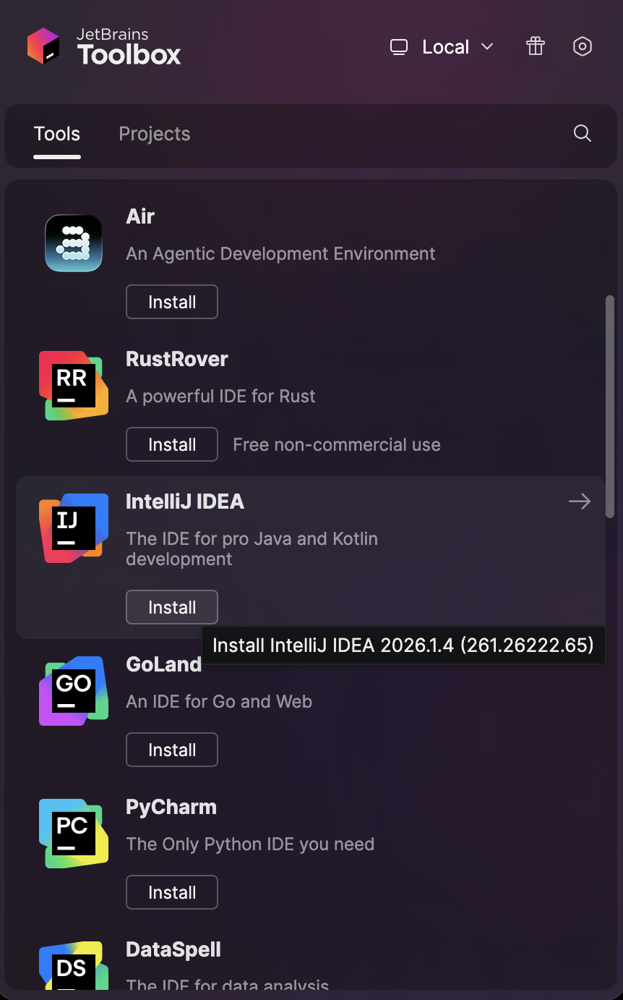

# Learning Microservices

This repository contains the code and notes from my journey of learning the **Microservices Architecture Pattern** from scratch.

## Step 1: Environment Configuration and Setup

### Prerequisites

Before starting, install **SDKMAN!**, which makes it easy to manage multiple Java versions on your machine.

### Install SDKMAN!

```bash
curl -s "https://get.sdkman.io" | zsh
```

### Load SDKMAN Environment

```bash
source "$HOME/.sdkman/bin/sdkman-init.sh"
```

### Verify SDKMAN Installation

```bash
sdk version
```

---

## Java Installation

This project uses **Java 17 (Temurin Distribution)**.

### View Available Java Versions

```bash
sdk list java
```

### Install Java 17

Select the desired version identifier from the list and install it:

```bash
sdk install java 17.0.19-tem
```

### Switch Between Java Versions

SDKMAN allows you to install and switch between multiple Java versions.

Example:

```bash
sdk use java 21.0.8-tem
```

### Verify Java Installation

```bash
java -version
```

---

## IDE Installation

I recommend using **IntelliJ IDEA** for Java development.

### Install JetBrains Toolbox

Download and install JetBrains Toolbox:

https://www.jetbrains.com/toolbox-app/

### Install IntelliJ IDEA

After installing JetBrains Toolbox:

1. Launch JetBrains Toolbox.
2. Find **IntelliJ IDEA** in the available products.
3. Click **Install**.
4. Open IntelliJ IDEA after the installation completes.

### Installation Screenshot



---

## Docker Installation

Download Docker Desktop:

https://www.docker.com/products/docker-desktop/

### Installation Steps

1. Download and launch the installer.
2. Install using the recommended settings.
3. macOS may ask to install Rosetta because some Docker components still rely on Intel-based binaries. Allow the installation if prompted.
4. Launch Docker Desktop.
5. Sign up or sign in to Docker Desktop.

### Verify Docker Installation

```bash
docker --version
```

---

## Kubernetes Tooling Setup

### Install kubectl

Install kubectl using Homebrew:

```bash
brew install kubectl
```

#### Verify Installation

```bash
kubectl version --client
```

### Install k3d

k3d is a lightweight Kubernetes distribution that runs Kubernetes clusters inside Docker containers. It is recommended over Minikube for local development because it is faster and consumes fewer resources.

#### Install k3d

```bash
brew install k3d
```

#### Create a Local Kubernetes Cluster

```bash
k3d cluster create micro-lab
```

This command:

- Creates a lightweight Kubernetes cluster.
- Creates Docker containers that act as Kubernetes nodes.
- Adds a new Kubernetes context to `~/.kube/config`.
- Makes the cluster accessible through `kubectl`.

#### Verify the Cluster

```bash
kubectl get nodes
```

#### How kubectl Communicates with k3d

```text
kubectl
   │
   │ reads
   ▼
~/.kube/config
   │
   │ contains
   ▼
API Server Address
   │
   ▼
localhost:6443
   │
   ▼
Docker Port Mapping
   │
   ▼
k3d Kubernetes Container
   │
   ▼
Kubernetes API Server
   │
   ▼
Returns Nodes/Pods/Services
```

### Install k9s

k9s provides a terminal-based UI for managing Kubernetes clusters.

```bash
brew install k9s
```

Launch k9s:

```bash
k9s
```

---

## Database Setup

### Install PostgreSQL

Install PostgreSQL 16 using Homebrew:

```bash
brew install postgresql@16
```

### Start PostgreSQL

```bash
brew services start postgresql@16
```

### Why PostgreSQL 16?

PostgreSQL 16 is recommended because:

- It is a stable and production-ready release.
- It is widely adopted by the industry.
- It works seamlessly with Spring Boot 3.x.
- Most tutorials and examples remain compatible with PostgreSQL 16.

### Verify Installation

```bash
psql --version
```

### Connect to PostgreSQL

```bash
psql postgres
```

If this does not work, ensure the PostgreSQL service is running:

```bash
brew services list
```

---

## Messaging Setup

### Kafka Setup

Instead of installing Kafka directly on your machine, run Kafka using Docker Compose.

Create a `docker-compose.yml` file with the following content:

```yaml
services:
  kafka:
    image: bitnami/kafka:latest
    container_name: kafka
    ports:
      - "9092:9092"
```

Start Kafka:

```bash
docker compose up -d
```

Verify Kafka container status:

```bash
docker ps
```

### Why Run Kafka in Docker?

- Keeps the local machine clean.
- Simplifies upgrades.
- Makes the setup reproducible across environments.
- Aligns with how Kafka is commonly deployed in modern development environments.

---

## Recommended Tool Stack

| Tool | Purpose |
|--------|----------|
| SDKMAN | Java version management |
| Java 17 | Primary development JDK |
| IntelliJ IDEA | Java IDE |
| Docker Desktop | Container runtime |
| kubectl | Kubernetes CLI |
| k3d | Local Kubernetes cluster |
| k9s | Kubernetes terminal UI |
| PostgreSQL | Relational database |
| Kafka | Event streaming platform |

---

## Next Steps

The next section will cover:

1. Creating the first microservice project.
2. Setting up the project structure.
3. Configuring Spring Boot.
4. Connecting the application to PostgreSQL.
5. Containerizing the application using Docker.
6. Deploying the application to the local k3d Kubernetes cluster.